# Baixando e Configurando a VM do PnetLab

## Download da VM

Faça o download da VM do PnetLab no link abaixo:

[Baixar VM do PnetLab](https://drive.google.com/drive/folders/1h8y6L2dacmzpYOo9l2sSziUeawlDEpuZ?usp=sharing)

Após concluir o download, Siga os passos abaixo.

---

# Importando o Appliance

Abra o VirtualBox e clique em **Importar**.

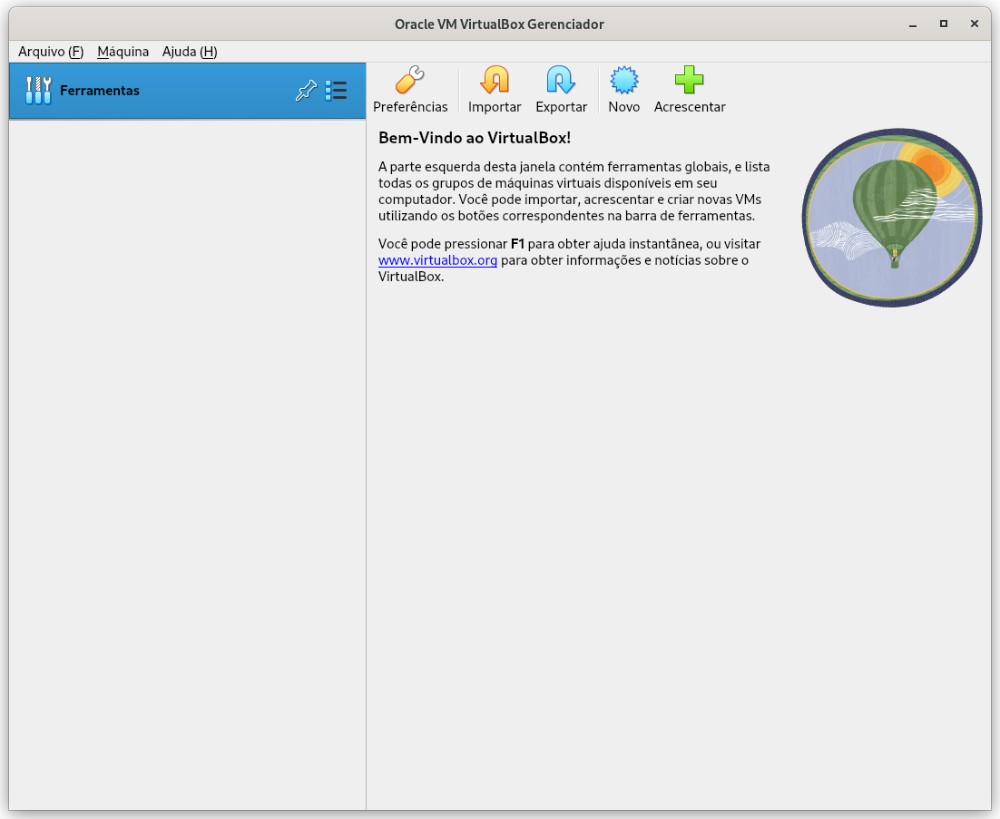

Selecione o arquivo ` PNetLAB+Cenarios.ova`  e clique em **Próximo**.

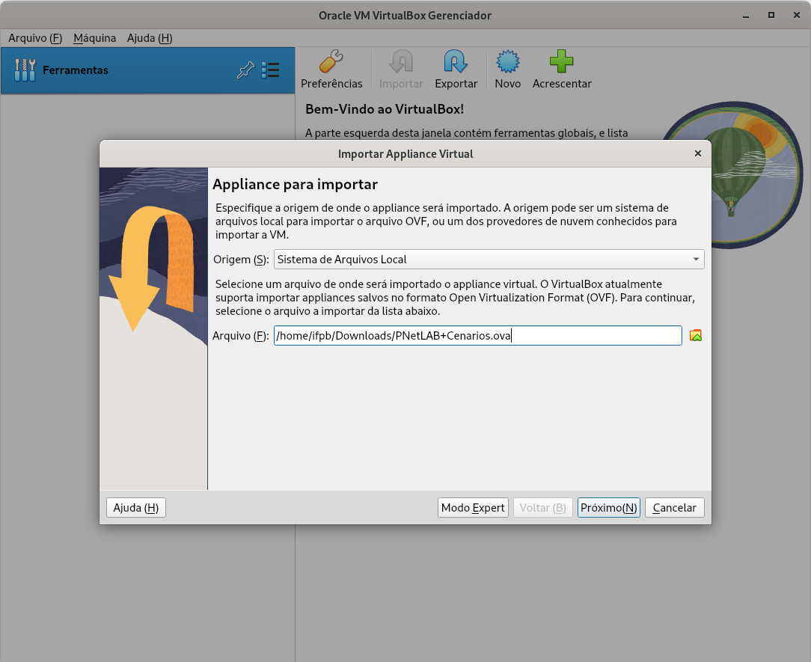
> [!NOTE]
> Adapte o caminho para o diretório onde o arquivo ` PNetLAB+Cenarios.ova` foi baixado.

Aguarde a importação do appliance ser concluída.
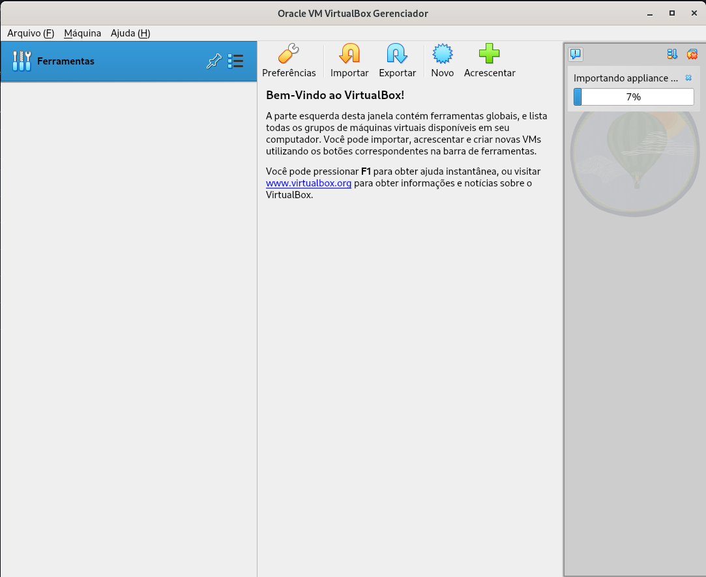

---

# Ajustes Necessários Após a Importação

Depois que a VM for importada, será necessário realizar alguns ajustes de rede.

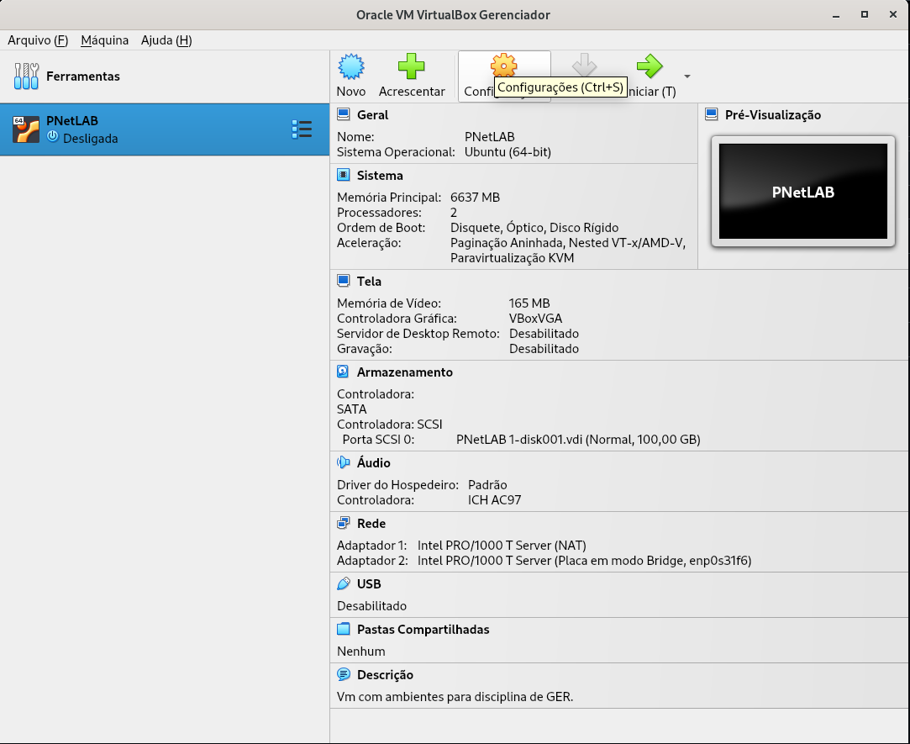

Abra as configurações da VM e acesse:

```text
Configurações > Rede
```

Para cada adaptador de rede (Adaptador 1 e Adaptador 2), gere um novo endereço MAC clicando em:

```text
Avançado > Gerar novo endereço MAC
```

Após gerar novos endereços MAC para os dois adaptadores, clique em **OK**.

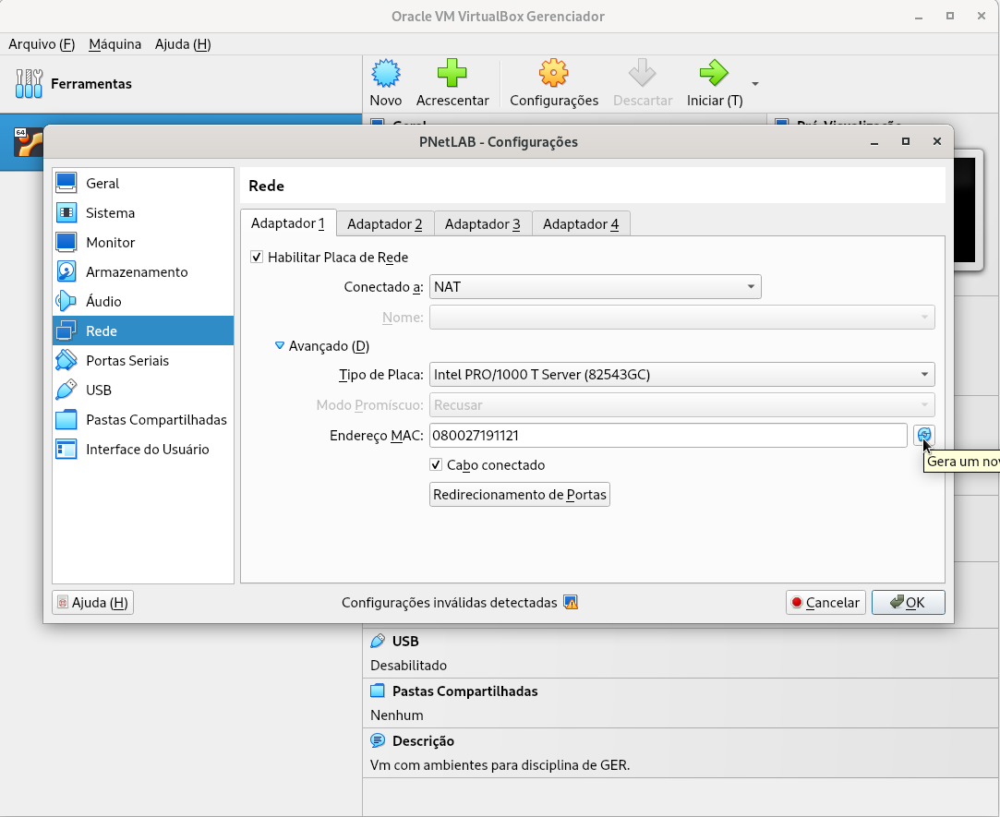

---

# Primeiro Boot da VM

Inicie a VM do PnetLab.

Faça login utilizando o `Usuário:` root e `Senha:` pnet

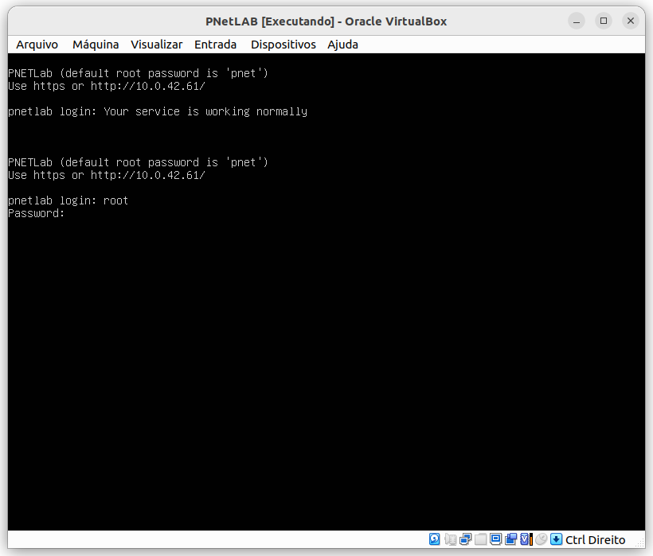

Durante a inicialização, pressione `Enter` para confirmar as etapas de configuração padrão. Não é necessário alterar nenhuma opção.

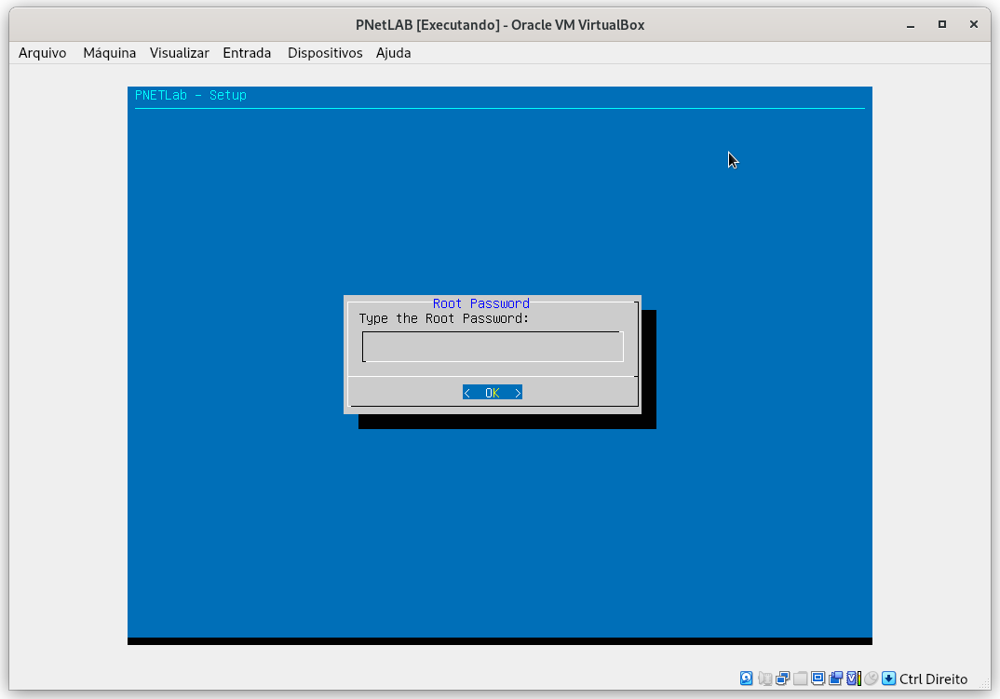

Após a confirmação das etapas, a VM será reiniciada automaticamente.

Quando a VM iniciar novamente, o PnetLab já poderá ser acessado via SSH e pelo navegador web

---

# Acessando a Interface Web

Abra o navegador e acesse o endereço IP exibido pela VM (Endereço IP da VM do PnetLab, Ex: 10.0.75.x).

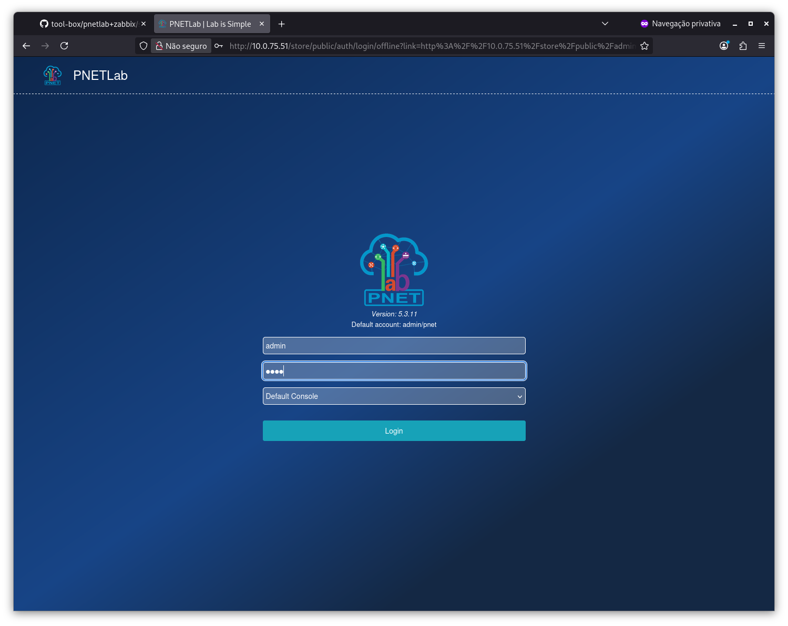

---

# Acessando os Cenários

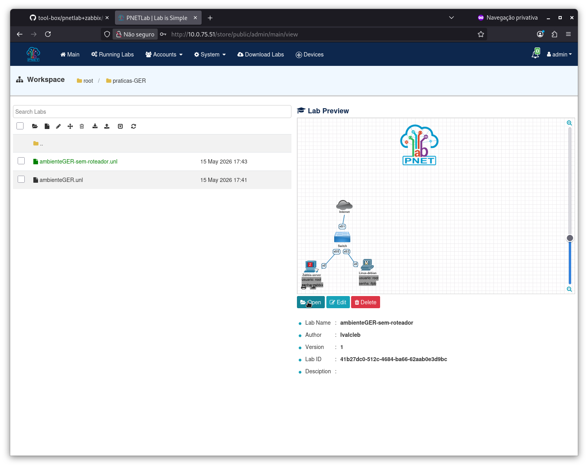

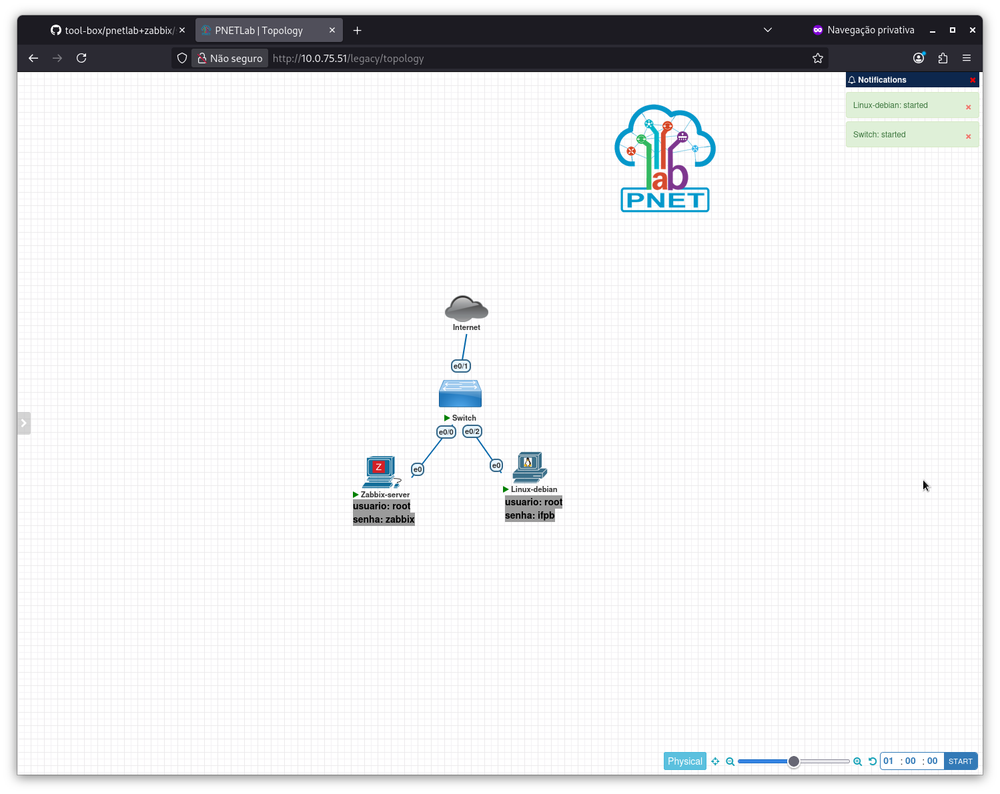

Dentro do PnetLab já existem dois cenários pré-configurados.

Você pode:

- Criar novos cenários
- Modificar os cenários existentes
- Adaptar os laboratórios conforme sua necessidade

---

# Como acessar a interface Web do Zabbix

Para acessar a interface Web do Zabbix, primeiro é necessário iniciar a VM `Zabbix-server` dentro do laboratório do PnetLab.  no cenário: `ambienteGER-sem-roteador` é necessario apenas iniciar o switch do cenário  e a VM `Zabbix-server`. Após a inicialização, a VM do Zabbix deverá receber automaticamente um endereço IP via DHCP do próprio PnetLab, geralmente na faixa: `10.0.137.x/24`

> [!NOTE]
> No cenário `ambienteGER`, pode ser necessário realizar configurações adicionais no roteador.

---

# Inicializando o ambiente

Dentro da VM `Zabbix-server`, execute o comando abaixo para verificar se a interface `eth0` recebeu um endereço IP:

```bash
ip -c a
```

Caso a interface não tenha recebido um IP automaticamente, execute:

```bash
dhclient eth0
```

Depois que a VM obtiver um endereço IP, anote esse valor. Ele será utilizado posteriormente na configuração da regra NAT.

---

# Criando a regra NAT no PnetLab

Para permitir o acesso à interface Web do Zabbix a partir do navegador da máquina física (host), será necessário criar regras NAT na VM do PnetLab. Para ficar mais fácil acesse a VM do PnetLab via SSH para executar os comandos abaixo.

> [!NOTE]
> Substitua `IP-DO-ZABBIX` pelo endereço IP obtido pela VM `Zabbix-server`, o IP que você anotou.

## Regra de redirecionamento

```bash
iptables -t nat -A PREROUTING -p tcp --dport 8080 -j DNAT --to-destination IP-DO-ZABBIX:80
```

Exemplo:

```bash
iptables -t nat -A PREROUTING -p tcp --dport 8080 -j DNAT --to-destination 10.0.137.174:80
```

## Regra de mascaramento

```bash
iptables -t nat -A POSTROUTING -j MASQUERADE
```

---

# Acessando a interface Web

Após configurar as regras NAT, a interface Web do Zabbix poderá ser acessada diretamente pelo navegador da máquina física utilizando:

```text
IP-DA-VM-PNETLAB:8080
```

Exemplo:

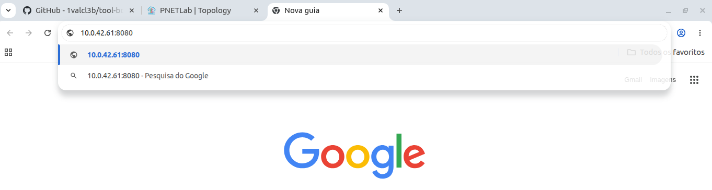
